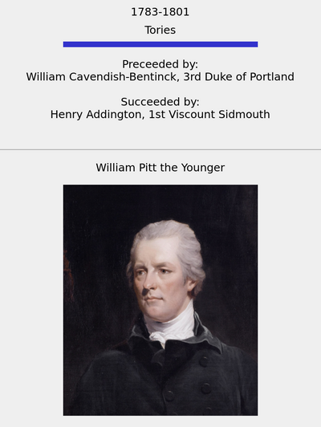

# WikiData2Anki.py

This script queries the [WikiData](https://query.wikidata.org/) knowledge graph
to find all persons that have held a certain political office, e.g. British
Prime Minister `Q14211`, and generates a deck of
[Anki](https://apps.ankiweb.net/) flashcards.

See [this blog post](https://jb753.user.srcf.net/anki2wikidata) for a fuller
exposition.

Requirements:
```
pip install sparqlwrapper genanki
```

Usage:
```
python wikidata2anki.py OFFICE_ITEM_ID
```

For example, to generate a deck of British Prime Ministers,

```
python wikidata2anki.py Q14211
```


